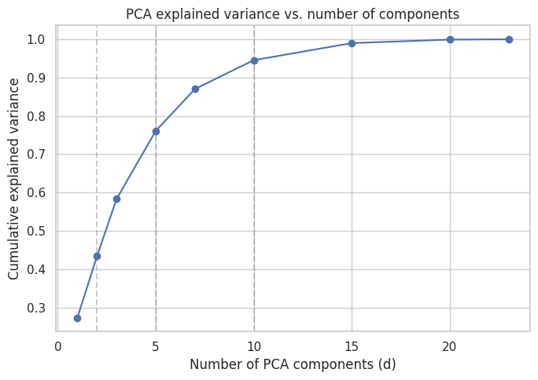
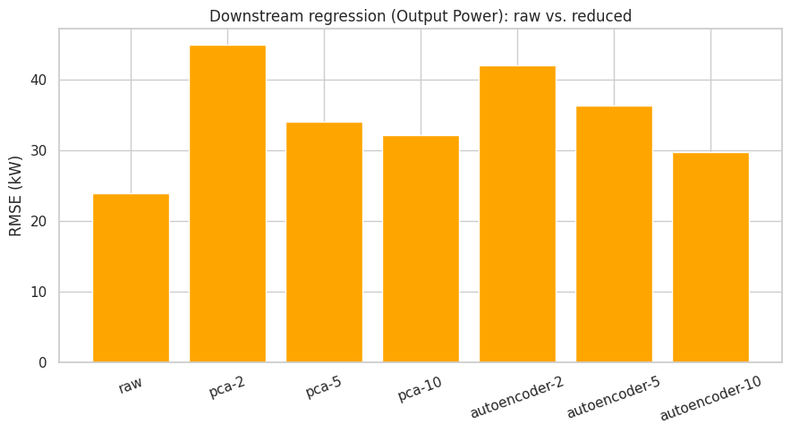
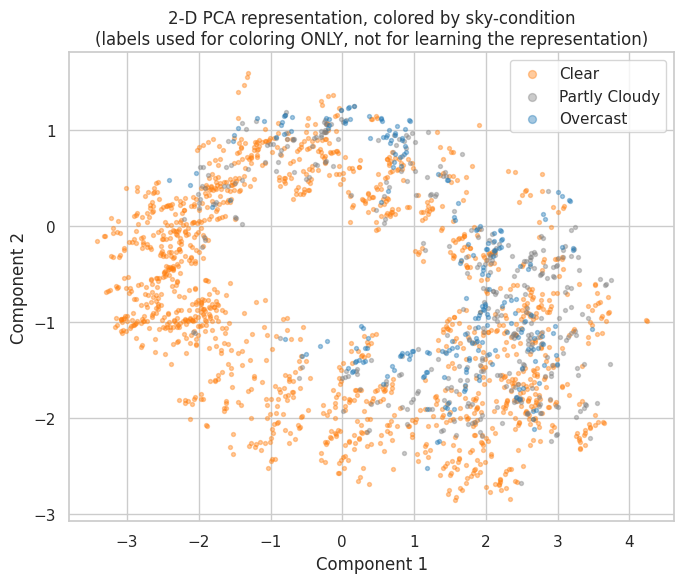
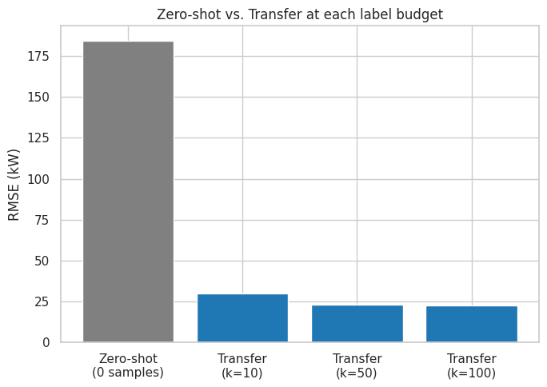

# Photovoltaic (Solar) Power Prediction on Large-Scale Spatiotemporal Data

**Machine Learning Course Project**

Student: [YOUR NAME]

Course: ECE571 Machine Learning

Professor: [PROFESSOR NAME]

Date: [DATE]

*Note: name, professor, and date are left as placeholders — they are
not recorded anywhere in the project's files, so they are not
invented here. Please fill these in before submitting.*

---

## Abstract

Photovoltaic (PV) power output is intermittent and entirely dependent
on weather, which makes it a useful problem for exploring several
different machine learning approaches on the same data. This project
uses a multi-year irradiance, weather, and PV-output dataset covering
five U.S. cities (Amherst MA, Davis CA, Huron SD, Santa Barbara CA,
and La Jolla CA) to work through five machine learning paradigms:
supervised classification, supervised regression, dimension
reduction, semi-supervised learning, and transfer learning. Classical
models (logistic regression, random forests, gradient boosting) and
deep models (multi-layer perceptrons, a GRU, and an autoencoder) were
compared under a consistent chronological train/test protocol
designed to prevent data leakage. The strongest result was same-city
Output Power regression for Davis (RMSE = 15.17 kW, R² = 0.953).
Two of the five paradigms produced clearly negative results rather
than improvements: dimension reduction reduced downstream performance
at every tested compression level, and semi-supervised pseudo-labeling
produced a small negative gain at every labeled-data fraction tested.
Transfer learning, in contrast, clearly helped — a Davis-pretrained
model fine-tuned on just 10 Amherst samples cut RMSE by 21.4% compared
with training on those same 10 samples alone. The most interesting
finding came from diagnosing why an early version of that transfer
experiment actually made things worse: an overly conservative
fine-tuning learning rate, not a fundamental limitation of transfer
learning, was the cause, and correcting it reversed the result
entirely. Overall, the project's main conclusion is that whether an
advanced ML technique helps on a given problem is something that has
to be tested directly, not assumed in advance.

---

## 1. Introduction

Solar photovoltaic generation is one of the fastest-growing sources of
electricity, but it is also one of the hardest to plan around. Unlike
a fossil-fuel plant, a PV installation cannot be turned up on demand —
its output is set entirely by the weather. This property is usually
called **intermittency**, and it creates real operational problems:
grid operators need to know how much power to expect over the next
hours so they can schedule other generation and reserves; battery
storage systems need forecasts to decide when to charge and discharge;
and utilities planning a new installation in an area with little or no
historical data need some way to estimate what it will produce. All
three of these problems are, at their core, machine learning
problems — relating weather and irradiance conditions to electrical
output, sometimes with plenty of historical data available and
sometimes with very little.

The role of weather and irradiance here is direct: solar panels
convert incoming sunlight (irradiance) into electricity, so the amount
of irradiance reaching the panels — which depends on cloud cover,
time of day, season, and atmospheric conditions — is the single
biggest driver of how much power comes out. This is exactly why
weather-based features are the whole basis for every model in this
project.

This project uses a real dataset of irradiance, weather, and measured
PV Output Power across five U.S. cities to explore this family of
problems, broken into five distinct ML paradigms rather than a single
end-to-end pipeline, so that each technique can be tested cleanly
against its own appropriate baseline:

1. **Supervised Classification** — can weather features predict a
   discrete sky condition or generation level?
2. **Supervised Regression** (the project's core task) — how
   accurately can continuous Output Power be predicted, same-city,
   across cities, and as a short-term forecast?
3. **Dimension Reduction** — can the feature space be compressed
   without losing the information the earlier tasks depend on?
4. **Semi-Supervised Learning** — how much does having a large pool of
   unlabeled weather data help when only a few labels are available?
5. **Transfer Learning** — can a model trained on a data-rich city
   (Davis) help a data-poor city (Amherst)?

The goal of this project is not simply to produce the best possible
number on each task, but to test, honestly, which of these five
paradigms actually help for this kind of data — and to explain why, in
each case, using the methods and vocabulary covered in this course.

---

## 2. Dataset

The dataset comes from a single Excel workbook with 9 sheets covering
5 cities: **Amherst, MA** (2018–2020, 12,056 rows), **Davis, CA**
(2011–2016, 24,112 rows), **Huron, SD** (2011–2016, 24,112 rows),
**Santa Barbara, CA** (2011–2016, 24,112 rows), and **La Jolla, CA**
(2011–2016, 24,112 rows). Row counts are taken directly from the
project's dataset profile document, not estimated. Four of the nine
sheets are exact 2014–2016 subsets of the corresponding six-year
sheets, used for a 3-year vs. 6-year data-volume comparison in Problem
2. Readings are taken every 30 minutes across an 11-sample daytime
window (10:00–15:00) — the dataset does not include nighttime hours.

Each row contains 22 columns: irradiance measurements (GHI, DNI, DHI,
and their theoretical clear-sky equivalents), weather variables
(Temperature, Relative Humidity, Wind Speed, Wind Direction, Dew
Point, Pressure, Surface Albedo, Precipitable Water), a categorical
Cloud Type code, Solar Zenith Angle, and the target variable, **Output
Power**, measured in kW. Missing data is minimal: the only gap in the
entire workbook is 4 rows of missing Output Power in the Amherst sheet
(2020-07-06, four consecutive 30-minute readings).

**Table 1. Dataset overview.**

| City | Years | Rows | Mean Output Power (kW) | Std (kW) |
|---|---|---|---|---|
| Davis, CA | 2011–2016 | 24,112 | 164.0 | 67.4 |
| Amherst, MA | 2018–2020 | 12,056 | 60.9 | 41.1 |
| Huron, SD | 2011–2016 | 24,112 | 50.1 | 16.4 |
| Santa Barbara, CA | 2011–2016 | 24,112 | 49.1 | 18.3 |
| La Jolla, CA | 2011–2016 | 24,112 | 47.3 | 15.6 |

A central challenge running through this project is that Output Power
has a different physical scale in every city — Davis's average output
is roughly 2.7–3.5 times that of the other four cities, reflecting
different installed plant capacities, not different weather quality.
This scale difference turns out to matter enormously for Problems 2
and 5, both of which involve comparing or transferring information
across cities.

**Figure 1** shows this scale difference directly: Output Power
distributions by city, with Davis's distribution visibly shifted well
above the other four.

---

## 3. Data Preprocessing

**Missing values.** Only 4 rows across the entire dataset had a
missing Output Power value (Amherst, 2020-07-06). These rows were
dropped rather than filled in, since interpolating a *target* value
and then training on it as if it were real ground truth would mean
learning from fabricated data.

**Categorical handling.** Cloud Type is a categorical code (for
example, code 3 vs. code 7), not a quantity — code 7 is not
numerically "more" than code 3. Treating it as an ordinary number
would imply a false ordering, so it is one-hot encoded everywhere it
is used, turning each possible cloud-type value into its own 0/1
column.

**Numerical scaling.** All continuous numeric features are
standardized (rescaled to zero mean, unit variance) using
scikit-learn's `StandardScaler`. This matters most for the neural
network models (Problems 1, 2, and 5's MLPs, and Problem 3's
autoencoder), which train more reliably when input features are on
comparable scales.

**Clear-Sky Index.** An engineered feature, `Clear-Sky Index = GHI /
Clearsky GHI` (with safe handling for any zero-denominator rows),
measuring how close actual irradiance is to the theoretical
clear-sky maximum. This index is what Problem 1's sky-condition label
is built from.

**Cyclical time features.** Hour-of-day, month, and day-of-year are
each converted into a pair of sine/cosine features rather than left as
raw integers. This is done because raw integers imply a false
"distance" — for example, hour 23 and hour 0 are adjacent in real
time but numerically as far apart as possible. Sine/cosine encoding
places adjacent times close together in feature space.

**Lag features and sequence windows.** For Problem 2's sequence
forecasting sub-task, a sliding window of the previous 12 readings
(roughly 6 hours, at 30-minute spacing) is used to predict the next
reading. This window size was chosen to give the model several hours
of recent history without extending into the previous day's readings.

**Train/test splitting.** Every same-city experiment in this project
uses a **chronological 80/20 split**: the earliest 80% of a city's
timestamps, in order, form the training set, and the most recent 20%
form the test set. This is a deliberate choice, not a default —
randomly shuffling the data before splitting would be invalid for
this kind of time-series problem, because it could place a later
reading in the training set and an earlier reading in the test set,
effectively letting the model "see the future" relative to what it is
being tested on. That would make every reported metric optimistic and
meaningless for genuine forecasting.

**Cross-city protocol.** Cross-city experiments (Problems 2 and 5) go
further: a model is trained entirely on the source city and evaluated
directly on a separate target city's data, with zero rows from the
target city touching anything used to fit the model — not the model
itself, and not any scaler or encoder.

**Leakage prevention, generally.** Every scaler and encoder in this
project is fit on training data only, then applied unchanged to the
corresponding test data — never fit on combined data, and never fit
on test data at all. This rule was checked directly by reading the
relevant code, not just assumed.

---

## 4. Experimental Setup

**Hardware.** All experiments in this project, including every neural
network, were developed and run on CPU — no GPU was available in the
development environment. The shared code automatically detects and
uses a GPU when one is available (via `torch.cuda.is_available()`),
so it would use the project owner's GPU hardware without any code
changes if run there.

**Software.** Python 3.12, with pandas, NumPy, scikit-learn, PyTorch,
and matplotlib as the core libraries. Exact package versions observed
during development: pandas 3.0.2, numpy 2.4.4, scikit-learn 1.8.0,
torch 2.14.0, matplotlib 3.10.8 (`requirements.txt` specifies
minimum-compatible version ranges rather than exact pins, so a
slightly different but compatible version set is expected on another
machine).

**Random seeds.** Every randomized experiment (model initialization,
few-shot sampling, stratified subset selection) used the same three
seeds — 42, 123, and 2026 — and results are reported as mean ± standard
deviation across all three seeds wherever three-seed data is
available.

**Train/test strategy.** Chronological 80/20 splits for all same-city
experiments (see Section 3); cross-city and transfer experiments use
one city's full chronological training pool as the source and a
separate city's chronological test split as the held-out evaluation
set.

**Evaluation metrics.** Classification tasks use accuracy, balanced
accuracy (the average of each class's recall, which prevents a
majority class from inflating the score), and macro F1 (F1 averaged
equally across classes). Regression tasks use RMSE (root mean squared
error, which penalizes large errors more heavily since errors are
squared before averaging), MAE (mean absolute error, the plain
average error size), and nRMSE (RMSE divided by the target's observed
range, which allows error comparison across cities or targets with
different scales).

**Model comparison strategy.** Within each problem, every model is
evaluated on the exact same train/test split and the exact same three
seeds, so comparisons between models are apples-to-apples. Small
hyperparameter searches (typically 3–5 candidate configurations) were
used where tuning was explored, selected using a chronological inner
validation split of the training data only — never the real test set.

**Table 2. Experimental setup summary.**

| Problem | Task | Dataset(s) | Models Compared | Main Metric |
|---|---|---|---|---|
| 1 | Sky-condition & generation-regime classification | Davis, Amherst | Majority baseline, logistic regression, decision tree, random forest, gradient boosting, MLP | Balanced accuracy |
| 2 | Output Power regression | Davis, Amherst (same-city); Davis→Huron/Santa Barbara/La Jolla (cross-city) | Mean baseline, linear/ridge regression, decision tree, random forest, gradient boosting, MLP, GRU (sequence) | RMSE |
| 3 | Dimension reduction (unsupervised) + downstream classification/regression | Davis | PCA, autoencoder, at d=2/5/10, vs. raw features | Downstream balanced accuracy / RMSE |
| 4 | Semi-supervised sky-condition classification | Davis | Supervised-only baseline vs. pseudo-labeling (+ Label Spreading) | Macro F1, at 10%/30%/50% labels |
| 5 | Transfer learning for Output Power regression | Davis → Amherst | Zero-shot, few-shot (fresh model), transfer (fine-tuned) | RMSE, at k=10/50/100 target samples |

---

## 5. Problem 1 — Supervised Classification

### Objective

Predict a discrete category from weather features. Two separate
classification tasks were built:

### Labels

- **Sky-condition** (Clear / Partly Cloudy / Overcast) — assigned by
  thresholding the Clear-Sky Index (`k`): Clear if k ≥ 0.85, Partly
  Cloudy if 0.4 ≤ k < 0.85, Overcast if k < 0.4. These thresholds come
  from the project specification, not chosen independently.
- **Generation-regime** (Low / Medium / High) — assigned using
  per-city Output Power terciles computed from each city's training
  data only, so the target city's own boundaries never leak from test
  data.

Because sky-condition is *defined* by GHI and Clearsky GHI, **both
columns were excluded from the classifier's input features** — using
them would let the model see the answer directly instead of learning
a genuine weather-to-sky-condition relationship. Solar Zenith Angle,
DHI, and DNI were also excluded, because together they can
approximately reconstruct GHI; this risk was verified directly, not
just assumed — including them in a test run pushed accuracy from
around 0.74–0.81 up to roughly 0.98, confirming the leak was real.

### Methods

Only models actually implemented and evaluated are reported here: a
majority-class baseline, logistic regression (plain and with balanced
class weighting), decision tree, random forest, gradient boosting, and
a small feed-forward multi-layer perceptron (MLP). Logistic regression
fits a linear boundary between classes; decision trees and their
ensemble variants (random forest, gradient boosting) split the data on
feature thresholds repeatedly; the MLP is a small neural network with
one or two hidden layers. Class-weighted and lightly-tuned variants of
several models were also tested.

### Results

**Table 3. Problem 1 results — Davis sky-condition, mean across 3 seeds.**

| Model | Accuracy | Balanced Accuracy | Macro F1 |
|---|---:|---:|---:|
| Majority baseline | 0.704 | 0.333 | 0.275 |
| Decision tree | 0.828 | 0.697 | 0.688 |
| Decision tree (balanced weight) | 0.811 | 0.678 | 0.668 |
| Random forest | 0.855 | 0.743 | 0.736 |
| Random forest (balanced weight) | 0.855 | 0.746 | 0.737 |
| Random forest (tuned) | 0.853 | 0.739 | 0.732 |
| Gradient boosting | 0.855 | 0.752 | 0.740 |
| Gradient boosting (tuned) | 0.856 | 0.754 | 0.742 |
| MLP | 0.853 | 0.755 | 0.739 |
| MLP (tuned) | 0.853 | 0.755 | 0.739 |
| Logistic regression | 0.857 | 0.769 | 0.749 |
| **Logistic regression (balanced weight)** | 0.831 | **0.772** | 0.720 |

The **best model by balanced accuracy was logistic regression with
balanced class weighting** (0.772) — narrowly ahead of plain logistic
regression (0.769), and ahead of every ensemble or neural-network
model tried. This was not the expected outcome going in; it suggests
that once the leakage-risk irradiance features are excluded, the
remaining predictors (mainly Cloud Type and general weather variables)
relate to sky-condition in a fairly direct way, so a simple,
well-regularized linear model does not lose much by not modeling
complex feature interactions.

### Confusion Matrix

**Figure 2** shows the confusion matrix for the best Davis
sky-condition model.

Per-class F1 scores for this model: Clear 0.946, Partly Cloudy 0.566,
Overcast 0.648. **Clear conditions were easiest to identify** — Clear
is also the majority class, at about 72% of the data. **Partly Cloudy
was the hardest class** — it sits on the Clear-Sky Index scale between
the other two classes and is confused with both neighbors rather than
having one dominant failure mode. This is the expected pattern for a
class defined by two adjacent thresholds instead of one: it inherits
ambiguity from both boundaries.

### Discussion

Balanced accuracy, not raw accuracy, was used as the primary metric
because of class imbalance: Overcast is the rarest class (about 11% of
Davis test rows), so a model that always predicted "Clear" would
already reach roughly 70% raw accuracy while providing no real
information. The finding that a simple linear model outperformed every
ensemble and neural network tested is a genuinely useful result for
this report — it suggests that, at least for this leakage-safe feature
set, the sky-condition relationship does not require a complex model
to capture well.

---

## 6. Problem 2 — Supervised Regression

### Objective

Predict continuous Output Power (kW), the project's core task, using
the full weather and irradiance feature set. Unlike Problem 1, there
is no leakage restriction on GHI-family features here — Output Power
is a physically measured quantity, not a rule-based function of these
columns.

### Same-City Experiment

Both Davis and Amherst were tested with a same-city chronological
80/20 split — training and evaluating within one city's own data.

### Cross-City Experiment

The Davis-trained model (gradient boosting, the same-city winner) was
applied directly, with no retraining, to three other cities actually
tested in this project: **Davis → Huron**, **Davis → Santa Barbara**,
and **Davis → La Jolla**. No other city pairs were evaluated in
Problem 2.

### Sequence Forecasting

A K=12 sequence window (the previous 12 readings, about 6 hours) was
used to predict the next reading with a GRU (gated recurrent unit)
recurrent neural network, trained and evaluated on Davis. This is
compared against a naive persistence baseline (predicting no change
from the last reading).

### Results

**Table 4. Problem 2 results (mean ± std across 3 seeds where applicable).**

| Model | City | RMSE (kW) | MAE (kW) | nRMSE |
|---|---|---:|---:|---:|
| **Gradient boosting** | **Davis (same-city)** | **15.17 ± 0.00** | **8.31** | **0.0600** |
| Gradient boosting (tuned) | Davis (same-city) | 15.39 | 8.44 | 0.0609 |
| Random forest (tuned) | Davis (same-city) | 15.52 | 7.98 | 0.0614 |
| MLP (tuned) | Davis (same-city) | 15.72 | 9.13 | 0.0622 |
| Linear regression | Davis (same-city) | 16.93 | 10.01 | 0.0670 |
| Mean baseline | Davis (same-city) | 71.84 | 60.72 | 0.2842 |
| Gradient boosting (tuned) | Amherst (same-city) | 20.29 ± 0.01 | 13.62 | 0.1595 |
| GRU (sequence, K=12) | Davis | 17.58 ± 0.10 | 10.04 | 0.0695 |
| Persistence baseline | Davis (sequence) | 21.97 | 15.04 | 0.0869 |
| Gradient boosting (zero-shot) | Davis → Huron | 125.81 ± 0.01 | 116.24 | 1.6920 |
| Gradient boosting (zero-shot) | Davis → Santa Barbara | 125.48 ± 0.61 | 116.55 | 1.6994 |
| Gradient boosting (zero-shot) | Davis → La Jolla | 124.39 ± 1.30 | 115.95 | 1.8146 |

*nRMSE throughout this report is range-normalized (RMSE divided by the
target's observed max − min), a convention fixed early in the project
and applied consistently everywhere it is computed.*

### Visualization

**Figure 3** shows predicted vs. actual Output Power for the best
Davis same-city model.

Points cluster tightly around the perfect-prediction diagonal line,
consistent with the high R² (0.953) for this model.

**Figure 4** compares the raw cross-city zero-shot RMSE against an
oracle target-mean baseline and a scale-corrected diagnostic
calculation.

### Discussion

**Strongest model:** gradient boosting, Davis same-city (RMSE = 15.17
kW, R² = 0.953) — notably, the *untuned* version, which slightly beat
its own tuned variant (15.17 kW vs. 15.39 kW).

**Weakest results:** the three cross-city zero-shot experiments, all
around RMSE = 124–126 kW — roughly 8 times worse than the same-city
result.

**Same-city vs. cross-city difference and likely cause:** this gap is
not evidence that weather fails to predict power in other cities. It
is almost entirely a **scale mismatch**: the Davis-trained model's
outputs are calibrated to Davis's own ~164 kW average, and applying
them directly to cities whose true averages are 47–50 kW produces
systematically oversized predictions. A diagnostic check — rescaling
Davis's raw predictions using the target city's own mean, for analysis
purposes only, since this uses information a genuine zero-shot
deployment would not have — recovered R² values of 0.55–0.84,
suggesting the underlying weather-to-power relationship transfers
reasonably well once the scale problem is accounted for.

**Sequence model:** the K=12 GRU (17.58 kW) clearly beat the
persistence baseline (21.97 kW), showing it learns genuine temporal
structure rather than simply repeating the last reading. It does not
beat the non-sequence same-city model (15.17 kW), but this is not a
fair like-for-like comparison — the non-sequence model has access to
the *concurrent* weather reading at the exact moment being predicted,
while the sequence model must forecast using only *past* readings, a
strictly harder task.

---

## 7. Problem 3 — Dimension Reduction

### Objective

Test whether the 23-feature (after encoding) input space used
elsewhere in this project can be compressed into fewer dimensions
without losing the information that Problems 1 and 2 depend on.
Dimension reduction is useful in general for reducing computation, for
visualization, and for removing redundant or noisy features — this
problem tests whether any of those benefits apply here, and whether
compression comes at a cost.

### Methods

Two methods were implemented and compared: **PCA** (principal
component analysis — the classical, linear method) and a small
**feed-forward autoencoder** (the deep, nonlinear method). Both are
**unsupervised** — they are fit using only the input features, with no
access to any label at all, and this was verified directly in the
code: neither the PCA-fitting function nor the autoencoder's training
function accepts a label argument. This matters because the whole
point of the comparison is to see whether compressing the *data's own
structure* (without looking at the answer) preserves enough
information to still predict the answer well — using labels to shape
the compression would be a different technique entirely, and would
make the comparison meaningless. Both methods were evaluated at three
latent dimensions: d = 2, 5, and 10. No other dimension-reduction
methods (such as a VAE) were implemented in this project.

### Explained Variance

**Figure 5** shows PCA's explained-variance curve across dimensions.

Cumulative explained variance was 0.434 at d=2, 0.761 at d=5, and
0.946 at d=10. d=10 was the largest dimensionality tested, chosen to
represent a "generous" compression that keeps most of the original
variance while still being a meaningful reduction from 23 dimensions.

### Reconstruction

**Figure 6** compares PCA and autoencoder reconstruction error across
dimensions.

The autoencoder reconstructed the original features more accurately
than PCA at every tested dimension (for example, at d=10:
autoencoder MSE = 0.026 vs. PCA MSE = 0.046), consistent with its
ability to learn nonlinear (curved) compressions where PCA is
restricted to linear projections.

### Downstream Classification

**Figure 7** compares raw features against every tested PCA and
autoencoder representation on the downstream sky-condition
classification task.

**Table 5. Problem 3 results — downstream classification and regression, Davis.**

| Representation | Explained Variance | Reconstruction MSE | Classification Balanced Accuracy | Regression RMSE (kW) |
|---|---:|---:|---:|---:|
| **Raw features** | — | — | **0.743** | **23.86** |
| PCA, d=2 | 0.434 | 0.336 | 0.401 | 44.86 |
| PCA, d=5 | 0.761 | 0.150 | 0.559 | 33.96 |
| PCA, d=10 | 0.946 | 0.046 | 0.571 | 32.10 |
| Autoencoder, d=2 | — | 0.204 | 0.457 | 41.93 |
| Autoencoder, d=5 | — | 0.062 | 0.568 | 36.29 |
| Autoencoder, d=10 | — | 0.026 | 0.661 | 29.69 |

*Note: to keep one shared representation valid for both downstream
tasks, Problem 3 uses the same leakage-safe (no-irradiance) feature
set as Problem 1 for both classification AND regression — so this
table's "raw" regression RMSE (23.86 kW) is not directly comparable to
Problem 2's own headline Davis result (15.17 kW), which uses the full
feature set including irradiance.*

### Downstream Regression

The same comparison for the regression task appears in Table 5 above.
**Figure 8** shows this visually.

### 2-D Visualization

**Figure 9** shows the PCA 2-D projection (d=2), colored by
sky-condition class, for visual inspection only — this coloring was
never used during fitting.

Some rough clustering by class is visible at d=2, but the classes
overlap substantially rather than forming clean, separated groups —
consistent with d=2's relatively low downstream accuracy (0.401). This
figure shows that *some* class-related structure survives compression
to 2 dimensions, but it does not show that this structure is enough to
reliably predict the class — those are two different claims, and only
the downstream accuracy numbers in Table 5 can support the second one.

### Discussion

**Did dimension reduction help? No — raw, uncompressed features
outperformed every tested reduced representation, at every tested
dimension, on both downstream tasks.** This was not the expected
outcome going into the experiment. A follow-up feature-ablation test
helps explain why: removing Cloud Type from the PCA input *raised*
explained variance (fewer total dimensions left to explain) but
*lowered* both reconstruction quality and downstream accuracy —
indicating that Cloud Type, despite being categorical, carries real
predictive signal that a small number of continuous latent dimensions
struggles to preserve. This is a reasonable explanation for the
overall result: with only 23 features to begin with (a fairly small
feature space already), and at least one of those features compressing
poorly, there may simply be limited redundancy left for compression to
exploit without losing something useful.

---

## 8. Problem 4 — Semi-Supervised Learning

### Motivation

Weather and irradiance readings are cheap to collect, but assigning a
sky-condition *label* to each one takes either manual annotation or an
independent calculation — so, realistically, a deployment might have
far more unlabeled weather readings than labeled ones. Semi-supervised
learning (SSL) asks whether a large pool of unlabeled data can be used
to make up for having only a small number of labels.

### Experimental Setup

Three label fractions were tested on Davis's sky-condition task: 10%,
30%, and 50%. For each fraction, that percentage of the training pool
was randomly selected (using stratified sampling, to guarantee every
class is represented even at 10%) to remain labeled; the exact same
rows' *features* (but not their labels) made up the remaining
unlabeled pool. The true labels of the "unlabeled" rows exist in the
underlying dataset — they were deliberately hidden from the SSL
method, not actually missing, so that the experiment could be
controlled. The same labeled subset was used for both the supervised
baseline and the SSL method, for a fair comparison.

### Baseline

A logistic regression classifier (balanced class weight — the same
model family that won Problem 1) trained *only* on the labeled subset,
with no access to the unlabeled data at all.

### SSL Method

The method actually implemented was **pseudo-labeling / self-training**:
train the classifier on the labeled subset; predict on the unlabeled
pool; keep only predictions at or above a confidence threshold (0.90,
selected by testing 0.80/0.90/0.95 on a held-out validation split, not
assumed); add those rows, labeled with the model's own prediction, to
the training set; retrain; repeat for up to 5 rounds or until no more
predictions clear the threshold. A safety cap of 1,000 pseudo-labels
per round was added after testing showed that, uncapped, the first
round alone added 12,170 labels, 98% of them the same class — a real
class-imbalance risk in the added pseudo-labels, not a hypothetical
one. An optional second method, Label Spreading (a graph-based
approach), was also tested and performed clearly worse than
pseudo-labeling at every fraction (balanced accuracy 0.585–0.631,
versus 0.744–0.767 for the supervised baseline).

### Results

**Table 6. Problem 4 results — Davis sky-condition, macro F1, mean ± std across 3 seeds.**

| Labeled Data | Supervised | Semi-Supervised | Gain |
|---:|---:|---:|---:|
| 10% | 0.700 ± 0.007 | 0.695 ± 0.003 | −0.0048 |
| 30% | 0.704 ± 0.015 | 0.704 ± 0.015 | −0.0006 |
| 50% | 0.715 ± 0.007 | 0.714 ± 0.006 | −0.0010 |

### Label-Efficiency Curve

**Figure 10** shows the label-efficiency curve — supervised-only
versus SSL, across all three label fractions.

**Whether SSL helped, and at which fraction:** SSL did not help at any
of the three label fractions tested, including 10% — the gain was
small and negative in every case, not just at the smallest fraction.
The two lines in Figure 10 sit almost on top of each other throughout.

**Possible reasons:** this was investigated directly rather than left
unexplained. An offline check — using the hidden true labels purely as
a diagnostic, computed only after training was already complete, and
never used to influence training or the confidence threshold — found
that the pseudo-labels were **100% accurate** at every fraction and
seed tested. The method was not adding incorrect information. Instead,
the added pseudo-labels were heavily concentrated on the already-easy
"Clear" class (98% of the first pseudo-labeling round, at 10% labels)
— reinforcing what the labeled subset already taught the model, rather
than providing new information about the harder Partly Cloudy /
Overcast boundary identified in Problem 1.

---

## 9. Problem 5 — Transfer Learning

### Motivation

Different PV installations, even ones responding to similar physical
principles (more sunlight → more power), differ in plant size, local
climate, and how much historical data is available. A brand-new or
smaller installation is unlikely to have years of labeled history the
way Davis does. Transfer learning tests whether knowledge learned from
a data-rich city can be reused to help a data-poor city, rather than
training that data-poor city's model completely from scratch.

### Source and Target

**Source: Davis** (data-rich, 19,289 training rows). **Target:
Amherst** (data-poor, 9,641 training rows, 2,411 held-out test rows).
These are the only source/target pair tested in this project.

### Zero-Shot

The Davis-pretrained model, applied directly to the Amherst test set,
with **zero** Amherst rows used anywhere in training or fitting
anything.

### Few-Shot

A **fresh** model (random initialization — no connection to the
Davis-trained model at all) trained *only* on a small number, k, of
Amherst samples. This project tested **k = 10, 50, and 100** — these
were the only sample sizes actually evaluated.

### Transfer Method

The Davis-pretrained model, **fine-tuned** (continuing training from
its existing weights, not reinitialized) on the exact same k Amherst
samples used for the few-shot baseline at that k, so the two methods
are compared on identical data. The model architecture (a small
feed-forward network: Dense(128) → ReLU → Dropout → Dense(64) → ReLU →
Dense(1)) is identical across zero-shot, few-shot, and transfer — the
only difference between few-shot and transfer is the starting point of
the weights.

### Results

**Table 7. Problem 5 results (mean across 3 seeds).**

| Method | Target Samples (k) | RMSE (kW) | nRMSE | Gain |
|---|---:|---:|---:|---:|
| Zero-shot | 0 | 184.17 | 1.4479 | — |
| Few-shot | 10 | 38.22 | 0.3004 | — |
| **Transfer** | **10** | **30.03** | **0.2361** | **+8.18 kW (+21.4%)** |
| Few-shot | 50 | 24.72 | 0.1944 | — |
| Transfer | 50 | 23.35 | 0.1836 | +1.37 kW (+5.5%) |
| Few-shot | 100 | 23.02 | 0.1810 | — |
| Transfer | 100 | 22.80 | 0.1793 | +0.22 kW (+0.9%) |

*Gain = few-shot RMSE minus transfer RMSE at the same k, i.e. how much
transfer improved on training from scratch on the same data.*

### Discussion

**What transferred:** the results indicate the underlying
weather-to-power relationship transfers reasonably well — transfer
clearly beat few-shot at every k tested, with the largest, most
practically meaningful gain at k=10 (+21.4%), shrinking as k grows and
the few-shot baseline gets enough real Amherst data to stand on its
own. A domain-shift analysis found moderate differences between Davis
and Amherst in Temperature, GHI, DNI, and Clear-Sky Index
(standardized mean differences of roughly 0.66–0.92) — real but not
extreme, consistent with a relationship that mostly carries over.

**What did not transfer automatically:** the output *scale*. Davis's
average output (~164 kW) is roughly 2.7 times Amherst's (~61 kW), and
this scale difference is the direct cause of the severe zero-shot
failure (RMSE = 184.17 kW) — the same underlying issue seen in
Problem 2's cross-city experiment.

**Negative transfer:** yes, negative transfer was observed directly
during this project's development, though not in the final reported
results above. An earlier version of the fine-tuning step used a
smaller learning rate for fine-tuning than for pretraining — a
strategy the project specification itself suggested as reasonable —
and this produced severe negative transfer: RMSE = 140.9 kW at k=10,
worse than the few-shot baseline's 38.2 kW. Investigating this
directly showed the model's average prediction was stuck near Davis's
~164 kW scale, because the smaller learning rate could not shift the
output level to Amherst's ~64 kW scale within a reasonable number of
epochs on only 10 samples. **Why:** matching the fine-tuning learning
rate to the pretraining rate, instead of shrinking it, resolved this
completely and produced the results reported in Table 7. Two follow-up
checks were run to make sure the right cause had been identified: an
ablation comparing raw-kW fine-tuning against explicit target
normalization showed no additional benefit once the learning rate was
fixed (23.35 kW raw vs. 24.11 kW normalized, at k=50) — confirming the
learning rate, not the absence of scale normalization, was the real
problem — and a separate ablation freezing the first hidden layer
during fine-tuning showed no meaningful difference either (23.35 kW
full fine-tuning vs. 23.40 kW frozen), suggesting the general
weather-to-output representation transferred largely intact.

**Figure 11** shows zero-shot, few-shot, and transfer RMSE at each
sample count.

**Figure 12** shows the Davis-vs-Amherst domain-shift comparison
referenced above.

---

## 10. Overall Comparison

The five problems use different tasks and different metrics (balanced
accuracy for classification, RMSE for regression), so their raw
numbers cannot be meaningfully combined into a single ranking — a
0.77 balanced accuracy and a 15 kW RMSE are not comparable
quantities. Instead, Table 8 summarizes the best result and headline
finding from each problem side by side.

**Table 8. Best result and main finding, by problem.**

| Problem | Best Method | Best Result | Main Finding |
|---|---|---|---|
| P1 — Classification | Logistic regression (balanced weight) | 0.772 balanced accuracy (Davis) | A simple linear model beat every ensemble and neural net tried |
| P2 — Regression | Gradient boosting | RMSE 15.17 kW, R²=0.953 (Davis) | Strongest single result in the project |
| P3 — Dimension Reduction | Raw features (no reduction) | 0.743 balanced accuracy / RMSE 23.86 kW | Compression hurt performance at every tested dimension |
| P4 — Semi-Supervised | Pseudo-labeling | Macro F1 ≈ 0.70 (all fractions) | SSL gain was ≈ 0 (slightly negative) at every label fraction |
| P5 — Transfer Learning | Transfer (fine-tuned), k=10 | RMSE 30.03 kW, +21.4% over few-shot | Transfer clearly helped, especially with scarce target data |

At a glance: **best classification result** — 0.772 balanced accuracy
(Davis sky-condition). **Best regression result** — RMSE 15.17 kW,
R²=0.953 (Davis same-city). **Dimension reduction effect** — clearly
negative (hurt both downstream tasks, every dimension tested). **SSL
effect** — essentially none (small negative gain at every fraction).
**Transfer-learning effect** — clearly positive (+21.4% at the
smallest, most realistic sample size).

---

## 11. Key Findings

### Finding 1 — A simple model beat every more complex model on Problem 1's classification task

**Evidence:** Logistic regression with balanced class weighting
reached 0.772 balanced accuracy on Davis sky-condition, ahead of
random forest (0.743–0.746), gradient boosting (0.752–0.754), and the
tuned MLP (0.755) — see Table 3.

**Interpretation:** once leakage-risk irradiance features are removed
from the input, the remaining relationship between weather features
and sky-condition appears to be simple enough that a linear model
captures it about as well as, or better than, more flexible models —
added model complexity did not translate into better performance here.

### Finding 2 — Dimension reduction consistently hurt performance

**Evidence:** raw features beat every tested PCA and autoencoder
representation, at every tested dimension (d=2, 5, 10), on both the
downstream classification task (0.743 vs. a best reduced score of
0.661) and the downstream regression task (23.86 kW vs. a best
reduced score of 29.69 kW) — see Table 5.

**Interpretation:** this dataset's feature space (23 dimensions after
encoding) may already be small enough that little redundancy remains
to compress away. A feature-ablation test traced part of the effect to
Cloud Type, a categorical variable that is highly predictive but
compresses poorly into a small number of continuous dimensions.

### Finding 3 — Semi-supervised pseudo-labeling did not improve on the supervised-only baseline at any label fraction tested

**Evidence:** SSL gain (macro F1) was −0.0048 at 10% labels, −0.0006
at 30%, and −0.0010 at 50% — see Table 6.

**Interpretation:** an offline diagnostic (using hidden true labels
only after training was complete) showed the pseudo-labels added were
100% accurate but concentrated almost entirely on the already-easy
"Clear" class. The method was not adding wrong information — it was
adding redundant information, which explains why performance did not
improve even though the added labels were correct.

### Finding 4 — Cross-city and zero-shot transfer failed severely under raw-kW evaluation, primarily due to output-scale mismatch

**Evidence:** Davis-trained models applied directly to other cities
produced RMSE around 124–184 kW (Problem 2's cross-city zero-shot,
Problem 5's zero-shot baseline), compared with 15–20 kW for same-city
models. A diagnostic rescaling of the Problem 2 cross-city predictions
by the target city's own mean recovered R² of 0.55–0.84.

**Interpretation:** the underlying weather-to-power relationship
appears to transfer reasonably well between cities; what fails without
adaptation is the output calibration, which differs by roughly
2.7–3.5× depending on the pair of cities involved.

### Finding 5 — Transfer learning provided a real, practically meaningful benefit, especially when target data was scarce

**Evidence:** fine-tuning the Davis-pretrained model on just 10
Amherst samples reduced RMSE by 21.4% (30.03 kW vs. 38.22 kW)
compared with training a fresh model on those same 10 samples — see
Table 7. The gain shrank to 5.5% at k=50 and 0.9% at k=100.

**Interpretation:** transfer learning's benefit is largest exactly
where it is most useful in practice — a newly instrumented site with
very few labeled readings — and diminishes naturally as more real
target-city data becomes available, which is the expected shape for
this technique to work as intended.

### Finding 6 — A single hyperparameter choice was the difference between severe negative transfer and a clear positive result

**Evidence:** an early version of the Problem 5 fine-tuning step,
using a smaller learning rate for fine-tuning than for pretraining,
produced RMSE = 140.9 kW at k=10 — worse than training from scratch
(38.2 kW). Matching the pretraining learning rate instead produced
RMSE = 27.2 kW in that same diagnostic comparison.

**Interpretation:** negative transfer, in this case, was not a
fundamental limitation of transfer learning for this problem — it was
caused by a specific, fixable implementation choice (an
overly-conservative learning rate that could not adjust the model's
output scale quickly enough). This suggests that conclusions about
whether transfer learning "works" for a given problem can depend
heavily on implementation details that are easy to get wrong.

---

## 12. Limitations

- **Limited geographic coverage.** Only 5 cities were available, and
  only one source/target pair (Davis→Amherst) was tested for transfer
  learning — the other three cities (Huron, Santa Barbara, La Jolla)
  were only evaluated zero-shot in Problem 2, not with fine-tuning.
- **Mid-day-only, no nighttime data.** Every reading in this dataset
  falls in the 10:00–15:00 window. Nothing in this project's results
  says anything about model behavior outside that window — a
  practical forecasting system would need nighttime and early-morning/
  evening behavior (where output is near zero) handled separately, or
  the dataset would need to be extended to cover them.
- **City-specific PV plant scale.** Output Power's different physical
  scale across cities was a recurring complication addressed through
  fine-tuning (Problem 5) or accepted as an explained failure mode
  (Problem 2's zero-shot results) — not a limitation this project
  claims to have generally solved.
- **Weather-distribution and domain-shift differences.** The Problem 5
  domain-shift analysis found a notably large Wind Speed difference
  between Davis and Amherst (standardized mean difference of 2.61) —
  flagged as possibly a sensor or unit artifact rather than a
  confirmed climate fact, since it was not independently verified
  against the two cities' raw instrument documentation.
- **Missing data.** Minimal (4 rows total, one city), so this is not a
  significant limitation in practice, but it is worth noting the
  approach taken (dropping, not interpolating) as a stated choice.
- **Limited years of data for Amherst.** 3 years vs. 6 for the other
  cities — this asymmetry is exactly what motivates Problem 5, but it
  also means Amherst's own same-city regression result (Problem 2) is
  based on less data than Davis's.
- **Deliberately small hyperparameter searches.** Every tuning search
  in this project used 3–5 candidate configurations, not an exhaustive
  grid. This is a scope decision, not an oversight, but it does mean
  a larger search might find further improvements that were not
  explored.
- **No GPU during development.** All models, including every neural
  network, were trained on CPU. This does not affect correctness, but
  training times reported informally during development would be
  faster on GPU hardware.
- **Evaluation protocol scope.** Metrics are computed once per
  (model, seed) combination and averaged across 3 seeds; no formal
  statistical significance testing (e.g. paired t-tests between
  models) was performed, so claims like "gradient boosting beat random
  forest" reflect consistent mean differences across seeds, not a
  formal significance test.

## 13. Reproducibility

**Software.** Python 3.12; pandas, NumPy, scikit-learn, PyTorch, and
matplotlib as the core libraries (`requirements.txt` specifies
minimum-compatible version ranges; exact versions observed during
development were pandas 3.0.2, numpy 2.4.4, scikit-learn 1.8.0, torch
2.14.0, matplotlib 3.10.8).

**Hardware.** Developed and run entirely on CPU — no GPU was available
in the development environment. The shared `get_device()` utility
automatically detects and uses a GPU (including an RTX 2070, if that
is the hardware being used to run this project going forward) with no
code changes required.

**Random seeds.** `[42, 123, 2026]`, defined once and imported
identically by all five problems' code, used for every randomized
step (model initialization, few-shot sampling, stratified label
selection).

**Dataset.** `course/Further Consolidated Data, HnL.xlsx` — the single
raw Excel workbook this entire project is built from; never modified.

**Split strategy.** Chronological 80/20 for all same-city experiments;
cross-city and transfer experiments never allow target-city rows into
training or preprocessing (see Section 3).

**Code organization.** `problems/problemN_*/` holds each problem's
own code; `results/problemN/` holds its saved results, models, and
preprocessing objects; `figures/problemN/` holds its figures;
`src/` holds the shared framework code (data loading, cleaning,
feature engineering, splitting, preprocessing, evaluation,
visualization) reused by all five problems; `course_context/` holds
the full written record of decisions and findings for every phase.

**How to reproduce.** From the project root, with dependencies
installed (`pip install -r requirements.txt`), each problem's
experiments can be run with `python problems/problemN_*/
run_experiments.py`. `scripts/check_setup.py` verifies the environment
is set up correctly before running anything. Every experiment's
result is appended to that problem's `results/problemN/
problemN_results.csv`, never overwritten.

## 14. AI Assistance Disclosure

AI coding assistants were used throughout this project to help with
code scaffolding, debugging, documentation, experimentation ideas, and
iterative development across all five ML problems, the exploratory
data analysis, and this report. All generated code was reviewed and,
where necessary, modified by the student before being run. Every
result reported in this document comes from an experiment that was
actually executed and its output actually saved — none are estimated
or invented. Several real implementation issues were found and fixed
during this review-and-execution process rather than being missed —
for example, the Problem 5 learning-rate/negative-transfer episode
discussed in Section 9, and a package-compatibility bug encountered
during Problem 4's development. The student is responsible for
understanding the methods used, interpreting the results, and being
able to explain and defend every part of the submitted work.

## 15. Conclusion

This project tested five machine learning paradigms on the same solar
power forecasting problem, using the methods covered in this course,
and aimed to report honestly which paradigms helped and which did
not. Supervised learning performed well throughout, with the
strongest overall result being same-city Output Power regression for
Davis (RMSE = 15.17 kW, R² = 0.953). Two paradigms produced clearly
negative results under the conditions tested: dimension reduction
reduced downstream performance at every tested compression level, and
semi-supervised pseudo-labeling produced an essentially zero (slightly
negative) gain at every labeled-data fraction tested — both are
reported as genuine findings, not shortcomings to explain away.
Transfer learning was the clearest success among the "does this
technique help" questions this project asked: fine-tuning a
Davis-pretrained model on just 10 Amherst samples improved RMSE by
21.4% over training on those same 10 samples from scratch, though only
after a real negative-transfer episode was identified and corrected
during development. The most interesting finding overall was that this
negative-transfer episode traced back to a single hyperparameter (the
fine-tuning learning rate) rather than any fundamental limitation of
the technique — a reminder that whether an ML method "works" can
depend on implementation details as much as on the underlying idea.
Taken together, this project's main takeaway is that each of these
five paradigms needs to be evaluated on its own, against a fair
baseline, for the specific problem at hand — assuming in advance that
an advanced technique will help is not a substitute for testing it.
Future work suggested by these results includes a larger
hyperparameter search now that working baselines exist for each
paradigm, an investigation into the Wind Speed domain-shift anomaly
noted in Problem 5, and extending the transfer-learning approach to
the other data-scarce cities (Huron, Santa Barbara, La Jolla) that
were only evaluated zero-shot in Problem 2.

## References

1. Course material, ECE571 Machine Learning — lecture slides covering
   supervised classification, supervised regression, dimensionality
   reduction/PCA, semi-supervised learning, and transfer learning/
   fine-tuning, as provided for this course.
2. Project dataset: *Further Consolidated Data, HnL.xlsx* — irradiance,
   weather, and PV Output Power records for Amherst MA, Davis CA,
   Huron SD, Santa Barbara CA, and La Jolla CA, provided as part of
   the course assignment.
3. Pedregosa, F., et al. (2011). *Scikit-learn: Machine Learning in
   Python.* Journal of Machine Learning Research, 12, 2825–2830.
4. Paszke, A., et al. (2019). *PyTorch: An Imperative Style,
   High-Performance Deep Learning Library.* Advances in Neural
   Information Processing Systems 32.

*[Note: item 1 refers to the course's own lecture material generally,
since no single citable title/author/year was found recorded for the
individual PowerPoint files in the project's files — if a specific
citation format is required (e.g., individual lecture titles/weeks),
please provide it or confirm the general reference above is
sufficient.]*
