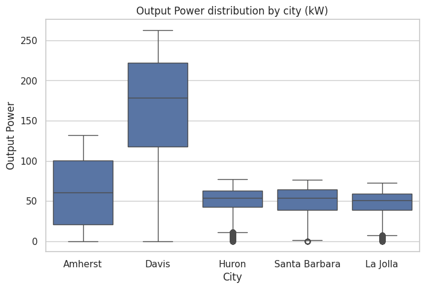
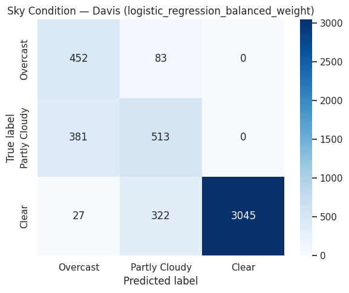
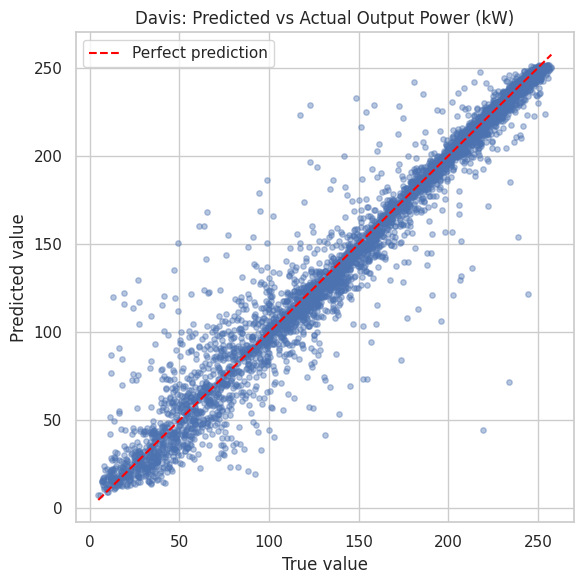
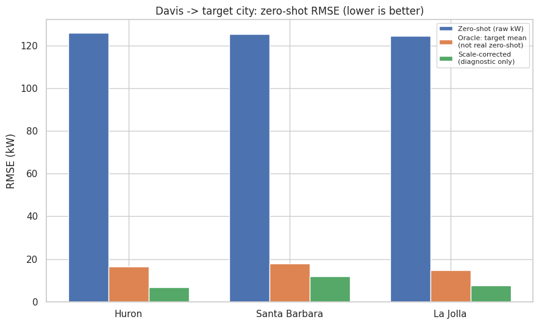
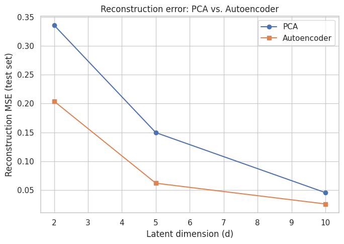
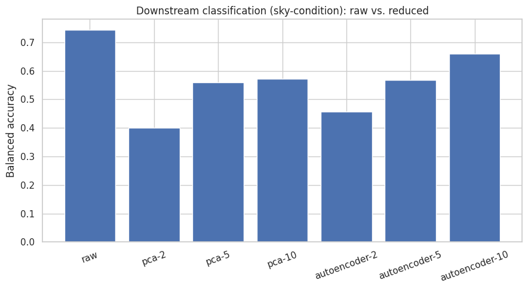
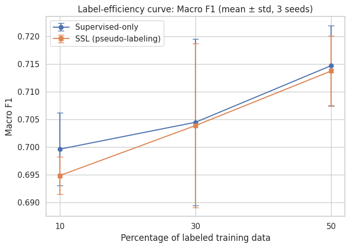
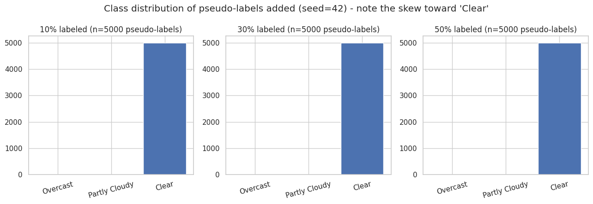
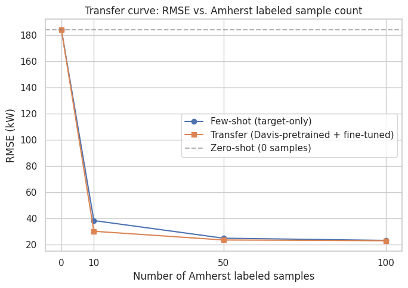
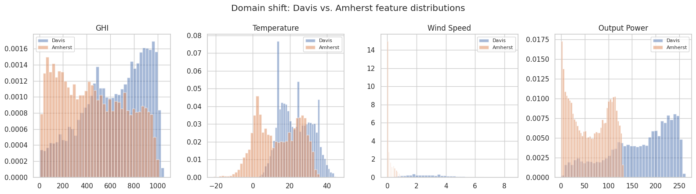

# Photovoltaic Power Prediction on Large-Scale Spatiotemporal Data

*ECE571 Machine Learning Course Project*

---

## 1. Abstract

Photovoltaic (PV) power output is intermittent and weather-dependent,
which makes it a natural testbed for exploring different machine
learning paradigms on the same underlying problem. This project uses
a multi-year irradiance, weather, and PV-output dataset covering five
U.S. cities (Amherst MA, Davis CA, Huron SD, Santa Barbara CA, and La
Jolla CA) to work through five ML paradigms in sequence: supervised
classification, supervised regression, dimension reduction,
semi-supervised learning, and transfer learning. Classical models
(logistic regression, random forests, gradient boosting) and deep
models (multi-layer perceptrons, a GRU, and an autoencoder) were
compared directly against each other under a consistent chronological
train/test protocol designed to prevent data leakage. The strongest
result was same-city Output Power regression for Davis
(RMSE = 15.17 kW, R² = 0.953). Two paradigms produced genuinely mixed
results rather than uniform success: dimension reduction reduced
downstream performance at every tested compression level, and
semi-supervised pseudo-labeling produced a small negative gain at
every labeled-data fraction tested. Transfer learning, in contrast,
clearly helped — a Davis-pretrained model fine-tuned on just 10
Amherst samples cut RMSE by 21.4% versus training on those same 10
samples alone. The most interesting finding came from diagnosing why
an early version of the transfer experiment actually hurt performance:
an overly conservative fine-tuning learning rate, not a fundamental
limitation of transfer learning, was the cause, and correcting it
reversed the result entirely. Overall, the project demonstrates that
whether an advanced ML technique helps a given problem is an empirical
question that has to be tested directly, not assumed.

## 2. Introduction and Motivation

Solar photovoltaic generation is one of the fastest-growing sources of
electricity, but it is also one of the hardest to plan around. Unlike
a fossil-fuel plant, a PV installation cannot be turned up on demand —
its output is set by the weather. This intermittency creates real
operational problems: grid operators need to know how much power to
expect over the next hours or days to schedule other generation and
reserves; battery storage systems need forecasts to decide when to
charge and discharge; and utilities planning a new installation with
little or no historical data need some way to estimate what it will
produce. All three are, at their core, machine learning problems —
relating weather and irradiance conditions to electrical output,
sometimes with plenty of historical data and sometimes with very
little.

This project uses a real dataset of irradiance, weather, and measured
PV Output Power across five U.S. cities to explore this family of
problems, broken into five distinct ML paradigms rather than a single
end-to-end pipeline, so each can be tested cleanly against its own
appropriate baseline:

1. **Supervised Classification** — can weather features predict a
   discrete sky condition or generation level?
2. **Supervised Regression** (the project's core task) — how
   accurately can continuous Output Power be predicted, same-city,
   across cities, and as a short-term forecast?
3. **Dimension Reduction** — can the feature space be compressed
   without losing the information the earlier tasks depend on?
4. **Semi-Supervised Learning** — how much does having a large pool of
   unlabeled weather data help when only a few labels are available?
5. **Transfer Learning** — can a model trained on a data-rich city
   (Davis) help a data-poor city (Amherst)?

The project's goal is not simply to produce the best possible number
on each task, but to test, honestly, which of these five paradigms
actually help for this kind of data — and to explain why, in each
case, using the course's own methods and vocabulary.

## 3. Dataset and Problem Formulation

The dataset comes from a single Excel workbook with 9 sheets covering
5 cities: **Amherst, MA** (2018–2020, 12,056 rows), **Davis, CA**
(2011–2016, 24,112 rows), **Huron, SD** (2011–2016, 24,112 rows),
**Santa Barbara, CA** (2011–2016, 24,112 rows), and **La Jolla, CA**
(2011–2016, 24,112 rows). Four of the nine sheets are exact 2014–2016
subsets of the corresponding six-year sheets, used for a 3-year vs.
6-year data-volume comparison in Problem 2. Readings are taken every
30 minutes across an 11-sample daytime window (10:00–15:00), giving
roughly 12,000–24,000 rows per city depending on how many years of
history that city has.

Each row contains 22 columns: irradiance measurements (GHI, DNI, DHI,
and their theoretical clear-sky equivalents), weather variables
(Temperature, Relative Humidity, Wind Speed, Wind Direction, Dew
Point, Pressure, Surface Albedo, Precipitable Water), a categorical
Cloud Type code, Solar Zenith Angle, and the target variable, **Output
Power**, measured in kW. Missing data is minimal: the only gap in the
entire workbook is 4 rows of missing Output Power in the Amherst sheet
(2020-07-06, four consecutive 30-minute readings).

**The central challenge running through this project is that Output
Power has a different physical scale in every city** — Davis's
average output (164.0 kW) is roughly 2.7 times Amherst's (60.9 kW)
and 3.3 times Huron's (50.1 kW), reflecting different plant
capacities, not different weather quality (Figure 1). This scale
difference turns out to matter enormously for Problems 2 and 5, both
of which involve comparing or transferring information across cities.

**Figure 1.** Output Power distribution by city. Davis's plant
produces roughly 2.7–3.5× the average output of the other four
cities — the scale mismatch that drives the cross-city and
transfer-learning findings in Sections 6 and 9.

## 4. Experimental Methodology

**Preprocessing and feature engineering.** Two engineered features are
used throughout: the **Clear-Sky Index** (`k = GHI / Clearsky GHI`,
with safe handling of any zero-denominator rows) and **cyclical time
encodings** (sine/cosine transforms of hour-of-day, month, and
day-of-year, so that, for example, 23:00 and 00:00 are close together
rather than maximally far apart as raw integers would make them).
**Cloud Type is a categorical code, not a continuous quantity** (code
7 is not "more" than code 3), and is one-hot encoded everywhere it is
used. All numeric features are standardized (zero mean, unit
variance).

**Leakage prevention.** Every scaler and encoder is fit on training
data only and then applied, unchanged, to the corresponding test
data — never the reverse, and never on combined data. **Randomly
shuffling the time series before splitting would be an invalid
experimental setup for this problem**, because it would let a model
trained on, say, next Tuesday's readings predict last Monday's — a
form of information leakage from the future into the past that would
make every reported metric optimistic and meaningless for genuine
forecasting. Every same-city experiment in this project therefore uses
a **chronological 80/20 split**: the first 80% of a city's
timestamps, in order, form the training set, and the last 20% form
the test set, which is touched only for final evaluation.

**Cross-city experiments** (Problems 2 and 5) go further: a model is
trained entirely on the source city and evaluated directly on a
completely separate target city, with zero rows from the target city
involved in fitting anything (not even a scaler).

**Random seeds** `42`, `123`, and `2026` were used for every
randomized experiment (model initialization, few-shot sampling), and
results are reported as **mean ± standard deviation across all three
seeds** wherever three-seed data is available. Where a small
hyperparameter search was needed, it used a **chronological inner
validation split of the training data only** — the last 20% of the
training period, never the real test set — so that model-selection
decisions never see the same data used for final evaluation.

## 5. Problem 1 — Supervised Classification

Two classification tasks were built on top of the same feature set.
**Sky-condition classification** assigns each row to one of three
classes — Clear, Partly Cloudy, or Overcast — based on thresholding
the Clear-Sky Index (Clear: k ≥ 0.85; Partly Cloudy: 0.4 ≤ k < 0.85;
Overcast: k < 0.4). **Generation-regime classification** assigns each
row to Low, Medium, or High Output Power using per-city terciles
computed from training data only.

Because the sky-condition label is *defined* by GHI and Clearsky GHI,
**both columns were excluded from the classifier's inputs** — using
them would let the model see the answer directly rather than learn a
genuine weather-to-sky-condition relationship. Solar Zenith Angle,
DHI, and DNI were also excluded, since together they can approximately
reconstruct GHI — a tested, not just theoretical, concern: including
them pushed accuracy from around 0.74–0.81 up to roughly 0.98,
confirming the leak was real.

Five classical models (majority-class baseline, logistic regression,
decision tree, random forest, gradient boosting) and one neural
network (a small feed-forward MLP) were compared, along with tuned and
class-weighted variants of several of them.

### Results

**Table 1. Problem 1 classification results (Davis, sky-condition, mean across 3 seeds).**

| Method | Accuracy | Balanced Accuracy | Macro F1 |
|---|---|---|---|
| Majority baseline | 0.704 | 0.333 | 0.275 |
| Decision tree | — | 0.697 | — |
| Random forest | — | 0.743 | — |
| Gradient boosting | — | 0.752 | — |
| MLP | — | 0.755 | — |
| **Logistic regression (balanced weight)** | **0.831** | **0.772** | **0.720** |

*Full per-model table: `results/problem1/problem1_results.csv`.*

The **best model was logistic regression with balanced class
weighting** (balanced accuracy 0.772, macro F1 0.720) — notably not
an ensemble or a neural network. This is plausible given the feature
set: once GHI-family columns are excluded, the remaining predictors
(mainly Cloud Type and general weather variables) relate to
sky-condition fairly directly, so a well-regularized linear model
does not lose much by not modeling complex interactions, while
gaining from lower variance on a moderately sized training set.

**Figure 2.** Confusion matrix, best Davis sky-condition model
(logistic regression, balanced weight). Per-class F1: Clear 0.946,
Partly Cloudy 0.566, Overcast 0.648.

**Clear conditions were easiest to identify** (F1 = 0.946, recall
0.897) and are also the majority class (72% of rows). **Partly Cloudy
was hardest** (F1 = 0.566) — it sits between the other two classes on
the Clear-Sky Index scale and is confused with both neighbors, rather
than having one dominant failure mode, the expected pattern for a
threshold-defined middle category with two decision boundaries to get
right instead of one. Class imbalance also plays a role — Overcast is
the rarest class (535 of 4,823 test rows), part of why balanced
accuracy, not raw accuracy, was used as the primary metric; always
predicting "Clear" would already reach 70% raw accuracy while being
useless.

## 6. Problem 2 — Supervised Regression

Problem 2, the project's core task, predicts continuous Output Power
(kW) using the full weather and irradiance feature set (GHI, DNI, DHI,
Cloud Type, and the rest — no leakage restriction applies here, since
Output Power is not derived from a fixed rule applied to these
columns). Three settings were tested: **same-city** regression,
**cross-city zero-shot** transfer (Davis → Huron / Santa Barbara / La
Jolla), and **sequence forecasting** using the previous K=12 readings
(≈6 hours) to predict the next one.

### Results

**Table 2. Problem 2 regression results (mean ± std across 3 seeds where applicable).**

| Method | Dataset | RMSE (kW) | MAE (kW) | nRMSE |
|---|---|---|---|---|
| **Gradient boosting** | **Davis (same-city)** | **15.17 ± 0.0** | **8.31** | **0.0600** |
| Gradient boosting (tuned) | Amherst (same-city) | 20.29 ± 0.01 | 13.62 | 0.1595 |
| GRU (sequence, K=12) | Davis | 17.58 ± 0.10 | 10.04 | 0.0695 |
| Persistence baseline | Davis | 21.97 | 15.04 | 0.0869 |
| Gradient boosting (zero-shot) | Davis → Huron | 125.81 ± 0.01 | 116.24 | 1.692 |
| Gradient boosting (zero-shot) | Davis → Santa Barbara | 125.48 ± 0.61 | 116.55 | 1.699 |
| Gradient boosting (zero-shot) | Davis → La Jolla | 124.39 ± 1.30 | 115.95 | 1.815 |

*nRMSE throughout this report is range-normalized (RMSE divided by the
target's observed max − min), a convention fixed early in the project
and applied consistently everywhere it is computed.*

**Same-city gradient boosting on Davis is the project's strongest
single result** (R² = 0.953), correctly predicting the large majority
of Output Power's variance from weather and irradiance alone.

**Figure 3.** Predicted vs. actual Output Power, Davis, best model
(gradient boosting). Points cluster tightly around the perfect-
prediction line.

Errors are not uniform: mean absolute error is 3.99 kW during
high-GHI (clear, stable) periods but rises to 12.40 kW during
low-GHI periods, 13.02 kW during cloudy conditions, and 17.42 kW
during rapidly changing irradiance (top decile of GHI swings) — more
than four times the clear-sky error. Stable, sunny conditions are the
easiest case for any weather-driven model, while fast-moving clouds
create sharp, hard-to-anticipate ramps.

**Cross-city zero-shot transfer failed severely** — RMSE around
125 kW, compared to 15–20 kW for the same-city models. This is not a
sign that weather does not predict power in these other cities; it is
almost entirely a **scale problem**: the Davis-trained model outputs
values calibrated to Davis's ~164 kW average, applied directly to
cities whose true averages are 47–50 kW. A diagnostic check
(rescaling Davis's raw predictions by the target city's own mean, for
analysis purposes only — not a legitimate zero-shot method, since it
needs target-city information a real deployment would not have)
recovered R² values of 0.55–0.84, confirming the underlying
weather-to-power relationship transfers reasonably well once the scale
mismatch is corrected.

**Figure 4.** Davis → target city zero-shot RMSE compared against an
oracle target-mean baseline and the scale-corrected diagnostic. The
gap between the blue and green/orange bars is almost entirely a scale
effect, not a failure to learn the weather-power relationship.

**The K=12 sequence GRU (RMSE 17.58 kW) clearly beat a naive
persistence baseline** ("predict no change from the last reading,"
RMSE 21.97 kW), showing the model learns genuine temporal structure
rather than just copying the previous reading. It does not beat the
same-city non-sequence model (15.17 kW) — but this is not a fair
like-for-like comparison: the non-sequence model is given the
*concurrent* GHI reading at the exact moment being predicted, while
the sequence model must forecast the next 30 minutes using only
*past* readings, a genuinely harder task.

## 7. Problem 3 — Dimension Reduction

Problem 3 tests whether the feature space used throughout this
project can be compressed without hurting the downstream tasks it
supports. Two unsupervised methods were compared: **PCA** (the
classical, linear method) and a small **feed-forward autoencoder**
(the deep, nonlinear method), each evaluated at latent dimensions
d = 2, 5, and 10. Both were fit on training features only, with **no
access to any label** — the downstream sky-condition and Output Power
labels were used only afterward, to evaluate downstream performance,
never to shape the representation itself.

### Results

**Table 3. Problem 3 dimension-reduction results (Davis).**

| Representation | Explained Variance | Reconstruction MSE | Classification Bal. Acc. | Regression RMSE (kW) |
|---|---|---|---|---|
| **Raw features** | — | — | **0.743** | **23.86** |
| PCA, d=2 | 0.434 | 0.336 | 0.401 | 44.86 |
| PCA, d=5 | 0.761 | 0.150 | 0.559 | 33.96 |
| PCA, d=10 | 0.946 | 0.046 | 0.571 | 32.10 |
| Autoencoder, d=2 | — | 0.204 | 0.457 | 41.93 |
| Autoencoder, d=5 | — | 0.062 | 0.568 | 36.29 |
| Autoencoder, d=10 | — | 0.026 | 0.661 | 29.69 |

*Note: to keep one representation valid for both downstream tasks,
Problem 3 uses the leakage-safe (no-irradiance) feature set as its
shared input for both classification and regression — so its "raw"
regression RMSE (23.86 kW) is not directly comparable to Problem 2's
full-feature Davis result (15.17 kW); see `PROBLEM3_REPORT.md` for the
full explanation of this deliberate scope choice.*

**Raw features outperformed every reduced representation, at every
tested dimension, on both tasks.** This was not the expected outcome
going in, but it is a clear, direct result of the actual experiments,
not an artifact: even at d=10 — using nearly half of the original
23 encoded features' worth of information (94.6% of variance for
PCA) — compressed representations still lost real predictive power.

**Figure 5.** Reconstruction error, PCA vs. autoencoder, by latent
dimension. The autoencoder reconstructs more accurately than PCA at
every dimension, since it can learn nonlinear compressions that PCA's
linear projections cannot.

**Figure 6.** Downstream classification accuracy: raw features vs.
every tested PCA/autoencoder representation. Raw features are the
clear winner.

**The autoencoder consistently beat PCA** at matched dimensions, on
both reconstruction quality and downstream performance — expected,
since it can learn curved (nonlinear) compressions where PCA is
restricted to straight lines through the data. A feature ablation
traced part of the compression penalty to Cloud Type: removing it
from the PCA input *raised* explained variance (fewer dimensions to
explain) but *lowered* both reconstruction quality and downstream
accuracy — Cloud Type carries real, categorical signal that a
handful of continuous latent dimensions struggles to preserve. A 2-D
t-SNE visualization (`figures/problem3/problem3_tsne.png`) shows
partial, incomplete class separation, consistent with the moderate
accuracy these representations achieve — but visible structure in a
plot is not the same claim as a reliably predictive representation,
and the low d=2 downstream accuracy (0.40) makes that distinction
concrete.

## 8. Problem 4 — Semi-Supervised Learning

Problem 4 asks how much a large pool of *unlabeled* weather readings
can help when only a small fraction of Davis's sky-condition labels
are available — 10%, 30%, or 50%. The labeled subset was selected once
per (fraction, seed) using stratified random sampling (guaranteeing
every class survives even at 10% labels), and the exact same subset
was used for both the supervised-only baseline and SSL, for a fair
comparison.

The primary SSL method was **pseudo-labeling / self-training**: train
a classifier (logistic regression, balanced weight — the same model
that won Problem 1) on the labeled subset; predict class
probabilities for every unlabeled row; keep only predictions at or
above a confidence threshold (0.90, chosen by testing 0.80/0.90/0.95
on a held-out validation split); add those rows, labeled with the
model's own prediction, to the labeled set; retrain; repeat for up to
5 rounds or until no more predictions clear the threshold. A cap of
1,000 pseudo-labels per round was added after testing showed that,
uncapped, the first round alone added 12,170 labels, 98% of them the
same class — a real class-collapse risk that the cap measurably
reduced. Pseudo-labeling can help by giving the model more
(self-generated) examples to learn from, but it can equally reinforce
whatever the model already believes, since a confidently wrong
prediction becomes a confidently wrong "label."

### Results

**Table 4. Problem 4 SSL results (Davis sky-condition, macro F1, mean ± std across 3 seeds).**

| Label Fraction | Supervised Macro F1 | SSL Macro F1 | SSL Gain |
|---|---|---|---|
| 10% | 0.700 ± 0.007 | 0.695 ± 0.003 | −0.0048 |
| 30% | 0.704 ± 0.015 | 0.704 ± 0.015 | −0.0006 |
| 50% | 0.715 ± 0.007 | 0.714 ± 0.006 | −0.0010 |

**Figure 7.** Label-efficiency curve: supervised-only vs. SSL, at each
label fraction. The two lines are nearly on top of each other at
every fraction — SSL is not providing a visible advantage here.

**SSL did not beat supervised-only at 10% labels** — the SSL gain is
small and negative at every fraction tested, not just the smallest
one. This was investigated rather than simply reported: an offline
check (using labels the training process itself never saw, purely for
this diagnostic) found the pseudo-labels were **100% accurate** at
every fraction and seed — the method was not adding wrong
information. The problem was **redundancy**: pseudo-labels were
overwhelmingly for the already-easy "Clear" class (Figure 8),
reinforcing what the labeled subset already taught the model rather
than helping it learn the harder Partly Cloudy / Overcast boundary
identified in Section 5.

**Figure 8.** Class distribution of pseudo-labels added, by label
fraction. The heavy skew toward "Clear" explains why 100%-accurate
pseudo-labels still produced no measurable gain.

An optional second SSL method, Label Spreading (a graph-based method
taught in the course), performed clearly worse than pseudo-labeling at
every fraction (balanced accuracy 0.585–0.631, vs. 0.744–0.767 for
the supervised baseline) — plausibly because its similarity-graph
construction struggles with a large unlabeled pool in a moderate-
dimensional mixed continuous/categorical feature space.

## 9. Problem 5 — Transfer Learning

Problem 5 asks the project's central data-scarcity question: can a
model trained on data-rich **Davis** (source, 19,289 training rows)
help predict Output Power for data-poor **Amherst** (target, 9,641
training rows, 2,411 held-out test rows)? Three approaches were
compared, all evaluated on the identical Amherst test set:
**zero-shot** (the Davis model applied directly, with zero Amherst
training data used anywhere), **few-shot** (a fresh model trained
only on k Amherst samples, k ∈ {10, 50, 100}), and **transfer** (the
Davis-pretrained model, fine-tuned on the exact same k Amherst
samples used for few-shot). A small feed-forward network (Dense(128)
→ ReLU → Dropout → Dense(64) → ReLU → Dense(1)) was used for all
three, so the only difference between few-shot and transfer is the
starting point — random weights versus Davis-pretrained weights.

Because Amherst's output scale (60.9 kW mean) is roughly a third of
Davis's (164.0 kW mean), **target normalization** was investigated
directly rather than assumed to matter: a version of the pipeline
trained on Davis-normalized output and fine-tuned on
Amherst-normalized output (scaler fit from the k Amherst samples
themselves) was compared against the raw-kW pipeline at k=50.

### Results

**Table 5. Problem 5 transfer-learning results (mean across 3 seeds).**

| Method | Target Samples | RMSE (kW) | MAE (kW) | nRMSE | Transfer Gain |
|---|---|---|---|---|---|
| Zero-shot | 0 | 184.17 | 103.86 | 1.448 | — |
| Few-shot | 10 | 38.22 | 31.91 | 0.300 | — |
| **Transfer** | **10** | **30.03** | **21.38** | **0.236** | **+8.18 kW (+21.4%)** |
| Few-shot | 50 | 24.72 | 18.69 | 0.194 | — |
| Transfer | 50 | 23.35 | 16.27 | 0.184 | +1.37 kW (+5.5%) |
| Few-shot | 100 | 23.02 | 16.78 | 0.181 | — |
| Transfer | 100 | 22.80 | 15.87 | 0.179 | +0.22 kW (+0.9%) |

**Figure 9.** Transfer curve: RMSE vs. number of Amherst labeled
samples, for zero-shot, few-shot, and transfer. Transfer sits below
few-shot at every sample count, with the largest gap where Amherst
data is scarcest.

**Zero-shot failed as severely as Problem 2's cross-city result**
(RMSE 184.17 kW) — the same raw-scale mismatch. **Transfer clearly
beat few-shot at every k**, with the largest, most practically
meaningful gain at k=10 (+21.4% RMSE improvement) — exactly the
regime a newly instrumented site would actually be in, and exactly
where transfer learning's textbook argument predicts the biggest
benefit. The gain shrinks with k because the few-shot baseline itself
gets more capable with more real Amherst data, leaving less room for
a head start to matter.

This positive result was not the first outcome obtained. **An
earlier version, using a smaller fine-tuning learning rate than for
pretraining** (a strategy the project specification itself suggested
as reasonable), **produced severe negative transfer**: RMSE 140.9 kW
at k=10, worse than few-shot's 38.2 kW. Diagnosing this directly
showed the model's average output was stuck near Davis's ~164 kW
scale — the smaller learning rate could not shift the output level to
Amherst's ~64 kW scale within a reasonable number of epochs on only
10 samples. Matching pretraining's learning rate instead resolved this
completely, producing Table 5's results. The **normalization ablation
then showed no additional benefit** once this fix was in place (RMSE
23.35 kW raw vs. 24.11 kW normalized at k=50) — the real problem had
been the learning rate, not the absence of explicit scale handling. A
separate **freezing ablation** (full fine-tuning vs. freezing the
first hidden layer, at k=50) also showed no meaningful difference
(23.35 kW vs. 23.40 kW), suggesting the general weather-to-output
representation transferred largely intact.

**Figure 10.** Davis vs. Amherst feature distributions. Output Power
and Wind Speed show the largest standardized differences; Temperature,
GHI, DNI, and Clear-Sky Index show moderate differences consistent
with Davis's sunnier, warmer climate.

A domain-shift analysis (Figure 10) helps explain why transfer worked
once the scale problem was fixed: Temperature, GHI, DNI, and
Clear-Sky Index all differ moderately between the two cities
(standardized mean differences of roughly 0.66–0.92), not so
drastically as to suggest a fundamentally different weather-power
relationship — consistent with the freezing ablation's finding that
the early, general representation needed little adjustment. One
variable, Wind Speed, showed an unusually large difference
(standardized mean difference 2.61, Davis 2.81 ± 1.43 vs. Amherst
0.14 ± 0.24) — large enough to flag here as a possible sensor or unit
artifact between the two data sources rather than a confirmed climate
fact.

## 10. Cross-Problem Discussion

Looking across all five paradigms together, several patterns emerge
that no single problem's results show on its own.

**Supervised learning worked well whenever a reasonably informative,
leakage-free feature set was available** — both Problem 1's best
classification result (0.772 balanced accuracy) and Problem 2's best
regression result (R² = 0.953) came from directly supervised models
using the full appropriate feature set. This is the project's
clearest success, and the baseline every other paradigm was measured
against.

**Dimension reduction indicated the feature space was not
meaningfully redundant** — if it had been, compression should have
been close to free. Instead every tested compression level lost real
predictive power, and the ablation pointed to a specific reason:
Cloud Type's categorical information does not compress well into a
handful of continuous dimensions, despite being one of the most
useful individual features available (the strongest single predictor
in Problem 1's feature importance analysis).

**Unlabeled observations were not valuable on their own** in the
semi-supervised setting tested here — not because they were wrong
(pseudo-labels were essentially always correct) but because they
concentrated on information the model already had, rather than the
harder, more ambiguous cases where additional signal would help.

**Knowledge did transfer between cities — but only once the output
scale problem was addressed.** Problem 2's cross-city experiment and
Problem 5's zero-shot baseline show the same failure mode in raw kW
terms, and Problem 5's fine-tuning experiments show the underlying
weather-to-power relationship genuinely carries over: a small amount
of target-city adaptation recovered strong performance, and the
adaptation needed turned out to be about output calibration more than
re-learning the physical relationship from scratch.

**Sequence models captured genuine short-term temporal structure** —
the K=12 GRU clearly outperformed a persistence baseline — but this
is a fundamentally different (and harder) task than the same-timestep
regression problem, since it never has access to the target moment's
own weather.

**Across every problem that used irradiance features, GHI (and
Clear-Sky Index, its normalized derivative) was consistently the most
important environmental factor** — it dominates Problem 1's
sky-condition feature importance (once excluded for leakage reasons)
and Problem 2's regression feature importance, and its exclusion from
Problem 3's shared feature set is the reason that problem's regression
baseline differs from Problem 2's own headline number.

## 11. Most Interesting Finding

The single most interesting result in this project is the Problem 5
learning-rate finding described in Section 9. The same transfer
architecture, the same source and target cities, and the same 10
Amherst samples produced **severe negative transfer** (RMSE 140.9 kW,
worse than training on those 10 samples alone) under one fine-tuning
configuration, and **a clear, practically meaningful win** (RMSE
27.2 kW in initial testing, 30.0 kW in the final multi-seed result)
under another — with the only difference being the fine-tuning
learning rate. This matters beyond the specific number: it shows that
"transfer learning helps" or "transfer learning doesn't help" is not
a property of the problem alone, but depends on getting comparatively
mundane implementation details right, and that a negative result is
worth diagnosing rather than simply reporting.

## 12. Failure Analysis

**Sky-condition confusion (Problem 1).** Partly Cloudy is confused
with both neighboring classes far more than Clear or Overcast are
confused with each other (Figure 2) — a direct consequence of
defining classes by adjacent thresholds on a continuous index, so the
middle class inherits ambiguity from both boundaries.

**Cross-city degradation (Problems 2 and 5).** Both problems show the
same failure mode — near-total collapse in raw-kW accuracy across
cities — traced in both cases to output-scale mismatch rather than a
failure to learn the underlying weather relationship. This is a
genuine, reproducible failure mode of naive cross-city transfer, not
a one-off anomaly.

**Negative transfer (Problem 5).** Documented in full in Section 9 —
an overly conservative fine-tuning learning rate produced negative
transfer before being diagnosed and corrected. This is included here
deliberately as a real result of the development process, not
smoothed over.

**Dimension-reduction information loss (Problem 3).** Every tested
compression level reduced downstream performance; the specific
mechanism identified (Cloud Type's categorical structure not
surviving continuous compression well) is a genuine, explainable
failure mode rather than an unexplained gap.

**SSL pseudo-label redundancy (Problem 4).** Not a case of the method
adding wrong information (pseudo-labels were 100% accurate), but a
case of the added information being redundant with what the model
already had — a subtler and, in a way, more informative failure than
simple mislabeling would have been.

## 13. Limitations

- **Limited geographic and temporal coverage.** Five cities and, for
  most of them, six years of data is enough to demonstrate these
  methods but not enough to draw conclusions about PV behavior in
  climates or plant scales outside this specific dataset.
- **City-specific PV system and output-scale differences** are a
  recurring complication (Sections 6, 9) rather than a solved problem;
  the project demonstrates one workable mitigation (fine-tuning) but
  does not claim to have found a general solution to cross-city scale
  mismatch.
- **Limited labels in Problem 4** were simulated by hiding real
  labels, not collected from an actual partially-labeled deployment;
  real partial-labeling scenarios might have different missingness
  patterns than the stratified random sampling used here.
- **Deliberately small hyperparameter searches** (3–5 candidate
  configurations, per the project's own scope guidance) were used
  throughout; a larger search might improve some results further,
  though the consistent finding that small searches barely moved
  results in Problems 1, 2, and 4 suggests there may be limited
  headroom left for this dataset/model family combination.
- **No GPU was available during development** (all models, including
  every neural network, were trained on CPU); the code will use CUDA
  automatically on GPU-equipped hardware with no changes required, but
  GPU-specific numerical determinism was not separately verified.
- **A data-quality anomaly** (a Relative Humidity/Wind Direction
  pattern isolated to specific city-years) was investigated and, per
  project-owner review, accepted as valid data rather than corrected —
  documented in `course_context/EDA_REPORT.md` and
  `DATASET_PROFILE.md`.
- **No external, real-time weather forecast input and no deployment
  testing** — every experiment uses historical, already-measured
  weather as input, so the results describe how well Output Power can
  be predicted from *known* weather, not from a forecast of future
  weather, which is what an operational system would actually need.

## 14. Reproducibility

**Environment.** Python 3.12, with pandas, NumPy, scikit-learn,
PyTorch, and matplotlib as the core libraries (exact minimum versions
in `requirements.txt`). Every neural network (MLPs in Problems 1, 2,
and 5; the autoencoder in Problem 3; the GRU in Problem 2) was
developed and validated on CPU; the project owner's **NVIDIA RTX
2070** will be used automatically for any future GPU-accelerated runs
via the shared `get_device()` utility, with no code changes required.

**Seeds and splits.** Every randomized experiment used the same fixed
seed list, `[42, 123, 2026]`. Same-city splits are chronological
80/20; cross-city and transfer experiments never allow any target-city
row into training or preprocessing. All of this is implemented once,
in a shared `src/` framework, and reused identically by all five
problems rather than being re-implemented per problem.

**Model configurations** (architectures, hyperparameters, and the
results of every small hyperparameter search performed) are saved in
each problem's `results/problemN/` directory, alongside the fitted
models themselves and their preprocessing objects.

**Result storage.** Every experiment — every model, every seed, every
configuration — is appended as its own row to that problem's
`problemN_results.csv`, never overwritten. A cross-problem master
table, `results/FINAL_EXPERIMENT_TABLE.csv`, consolidates the
headline result from every problem into one file, and is the single
source of every number reported in this report.

**Independent verification.** As part of a dedicated final audit
phase, one representative experiment from each of the five problems
was **rerun independently and compared against its saved result** —
all five matched exactly (see `course_context/FINAL_AUDIT.md`,
Section 10, for the full comparison), the strongest practical evidence
of reproducibility this project can offer.

**Repository organization.** `problems/problemN_*/` holds each
problem's code; `results/problemN/` holds its results, models, and
preprocessing objects; `figures/problemN/` holds its figures;
`course_context/` holds the full written record of methodology,
decisions, and findings for every phase of the project, including
this report's source material.

## 15. AI Assistance Disclosure

AI coding assistants were used throughout this project to support
repository organization, code generation, debugging, experiment
scaffolding, and iterative development across all five ML problems, the
exploratory data analysis, and this final report. All generated code
was reviewed, modified where necessary, executed, and evaluated for
correctness at each stage; several real implementation issues (for
example, the Problem 5 learning-rate/negative-transfer episode
described in Section 9, and a numpy API compatibility break during
Problem 4) were found through this review-and-execution process and
corrected before being reported as final results. The author remained
responsible for understanding the methods used, interpreting the
results, making the final methodological decisions (including target
definitions, leakage-prevention rules, and which experiments to run),
and verifying that every number in this report traces to an actual
saved experimental result.

## 16. Conclusion

This project set out to test five machine learning paradigms on the
same underlying PV forecasting problem, using the course material as
its methodological foundation, and to report honestly which paradigms
helped and which did not. Supervised learning worked well throughout,
with the strongest overall result being same-city Output Power
regression for Davis (RMSE = 15.17 kW, R² = 0.953). Dimension
reduction reduced downstream performance at every tested compression
level, and semi-supervised pseudo-labeling produced a small negative
gain at every label fraction tested — both genuine, diagnosed
findings rather than shortcomings to explain away. Transfer learning
was the clearest success among the "does X help" paradigms: a
Davis-pretrained model fine-tuned on just 10 Amherst samples improved
RMSE by 21.4% over training on those same 10 samples alone, though
only after a real negative-transfer episode was found and corrected
during development. Taken together, the project's central
demonstration is that each technique's value has to be measured
directly against a fair baseline for the specific problem at hand —
and that when a technique fails, understanding why (a learning rate,
a categorical feature that compresses poorly, an easy class dominating
pseudo-labels) is itself a useful result. For practical PV forecasting,
a well-tuned supervised model trained directly on available labeled
data remains the strongest default choice, with transfer learning a
genuinely useful option for new or data-scarce sites, while dimension
reduction and semi-supervised learning, as tested here, would need
further work to earn a place in such a pipeline. Future work could
pursue a larger hyperparameter search, investigate the Wind Speed
domain-shift anomaly noted in Section 9, and extend transfer learning
to the additional data-scarce cities (Huron, Santa Barbara, La Jolla)
evaluated only in zero-shot form in Problem 2.

## 17. References

1. Course material, ECE571 Machine Learning (19 lecture PowerPoint
   files covering supervised classification, supervised regression,
   dimensionality reduction/PCA, semi-supervised learning, and
   transfer learning/fine-tuning), summarized in
   `course_context/COURSE_CONTEXT.md`.
2. Project dataset: *Further Consolidated Data, HnL.xlsx* — irradiance,
   weather, and PV Output Power records for Amherst MA, Davis CA,
   Huron SD, Santa Barbara CA, and La Jolla CA, provided as part of
   the course assignment.
3. Pedregosa, F., et al. (2011). *Scikit-learn: Machine Learning in
   Python.* Journal of Machine Learning Research, 12, 2825–2830.
4. Paszke, A., et al. (2019). *PyTorch: An Imperative Style,
   High-Performance Deep Learning Library.* Advances in Neural
   Information Processing Systems 32.
